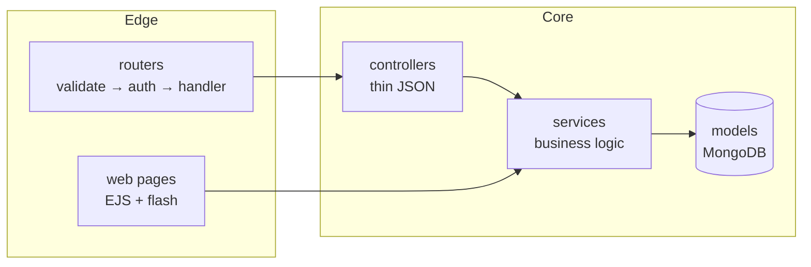

# Divar v2 — Classified Ads (Node.js + TypeScript)

[](https://github.com/1mimhe/divar-project/actions/workflows/ci.yml)


<div align="center">
    
</div>

A full-stack rewrite of a classified-ads platform ([Divar.ir](https://divar.ir/) clone): a versioned JSON API
plus server-rendered Persian (RTL, Jalali dates) pages from the same services. Built as a portfolio project
to demonstrate API design, auth hardening, domain modeling, testing and shipping.

> Screenshots: *to be added from a seeded run.*

## Requirements

- Node.js >= 22.6, npm, Docker (for the container path)

## Setup (containers)

```sh
git clone https://github.com/1mimhe/divar-project
cd divar-project
cp .env.example .env   # fill the four *-SECRET values (min 32 chars each)
docker compose up --build -d
docker compose exec app node --experimental-strip-types scripts/seed.ts
open http://localhost:3000
```

## Setup (local)

```sh
npm install
cp .env.example .env   # fill secrets; need MongoDB on 27018 (`docker compose up mongo -d`) or point MONGODB_URL at your own
npm run seed           # categories (+ promotes ADMIN_MOBILE when set)
npm run dev            # http://localhost:3000
```

Demo login: use any `09xxxxxxxxx` number; off-production the code is shown on the
verify page. Set `ADMIN_MOBILE` in `.env` before seeding to promote your user —
category/option writes are admin-only.

| Script          | What it does                                              |
| --------------- | --------------------------------------------------------- |
| `npm test`      | Full suite: unit (no DB) then e2e (needs MongoDB)         |
| `npm run test:unit` | Offline unit tests only                               |
| `npm run test:e2e`  | App-level and DB-backed flows (skips cleanly without Mongo) |
| `npm run seed`  | Idempotent category seed + optional admin promotion       |
| `npm run dev`   | Watch-mode server                                         |
| `npm start`     | Production-mode server (`NODE_ENV=production`)            |

## Features

- OTP login with resend cooldown, brute-force lockout and IP rate limits
- Short-lived access tokens + rotating refresh sessions (revocable per device)
- Category tree with typed per-leaf options (number/string/boolean/array + enums)
- Ads with strictly validated options, literal search, category-subtree filter, pagination and sorting
- Image uploads (uuid names, extension+mime check, 3 MB cap, cleanup on delete)
- Bookmarks and private per-user notes
- Admin-gated catalog writes (`isAdmin` flag + promotion script)
- Persian SSR pages: home grid, ad detail with gallery, OTP login, panel
  (dashboard, ad publishing with inline errors, my ads, bookmarks, notes)
- OpenAPI docs at `/swagger`, health at `/health`

## Architecture



- Layered modules under `src/modules/<feature>/`: `constants → types → schema →
  model → service → controller → routes` (+ `middleware`/`rateLimit` as needed).
- `src/common/` holds only generic code (error pipeline, validators, crypto, pagination).
- Controllers never contain business logic; services never touch `req`/`res`;
  all service errors are typed `ApiError`s rendered as `{ statusCode, error }`
  (JSON for `/api/*`, an error page elsewhere).
- Tests live in `tests/`: offline unit tests always run; DB-backed suites gate on
  a write probe and skip cleanly without Mongo.

## API

Interactive reference: `/swagger`. Base path `/api/v1`.

| Area      | Endpoints                                                        |
| --------- | ---------------------------------------------------------------- |
| Auth      | `POST /auth/otp/send`, `POST /auth/otp/verify`, `POST /auth/refresh`, `POST /auth/logout`, `GET /auth/me` |
| Users     | `GET /users`, `GET /users/:id` (admin; secrets never serialize)  |
| Categories| `GET /categories[?tree=true]`, `POST /categories`, `DELETE /categories/:id` |
| Options   | CRUD + `GET /options/by-category/:id`, `GET /options/by-category-slug/:slug` |
| Ads       | `GET /ads?search=&city=&category=&page=&limit=&sort=`, `POST /ads` (multipart), `GET /ads/mine`, `GET /ads/:id`, `DELETE /ads/:id` |
| Social    | `POST|DELETE /ads/:id/bookmark`, `GET /me/bookmarks`, `POST|GET|DELETE /ads/:id/note`, `GET /me/notes` |

Auth accepts the access token as an `httpOnly` cookie or `Authorization: Bearer`.
Limits: OTP dispatch 5/hour/IP, verification 10/10 min/IP plus 5 attempts per code.

## Pages

| Page                              | Route                          |
| --------------------------------- | ------------------------------ |
| Home grid + filters               | `GET /`                        |
| Ad detail + note form             | `GET /a/:id`                   |
| Login / verify                    | `GET /auth/login`, `POST /auth/otp/*` |
| Panel: dashboard, publish, my ads | `GET /panel`, `/panel/ads/new`, `POST /panel/ads`, `/panel/ads` |
| Panel: bookmarks, notes           | `GET /panel/bookmarks`, `GET /panel/notes` |

Forms re-render `422` with the error and preserved input; one-off messages use
session flash. Tests live in `tests/unit` (no database) and `tests/e2e`
(ephemeral apps plus Mongo-gated flows); CI runs both.

## Roadmap

- [ ] Screenshots + GIF walkthrough above
- [ ] Refresh-token device list ("log out everywhere" UI)
- [ ] Full-text search + image thumbnails
- [ ] fa/en language toggle (Persian-only today)
